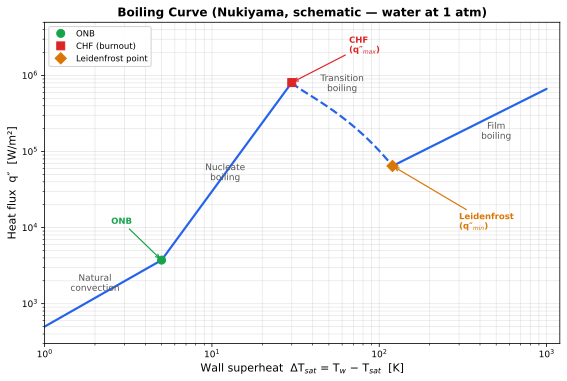

## Definition

Two-phase flow boiling is the process of heat transfer from a heated surface to a flowing fluid undergoing liquid-to-vapor phase change. It is the primary cooling mechanism exploited in two-phase cold plates, offering heat transfer coefficients 5–50× higher than single-phase liquid convection by harnessing latent heat absorption during vaporization.

## The Boiling Curve

The Nukiyama boiling curve (q″ vs. ΔT_sat) is the central organizing framework for boiling heat transfer. It maps four distinct regimes as wall superheat increases:

### Regime summary

| Regime | ΔT_sat range (water, 1 atm) | Mechanism | Heat transfer |
|--------|------------------------------|-----------|---------------|
| **Natural convection** | < ~5 K | Single-phase convection; no bubble nucleation | Low — h ∝ ΔT^0.25 (laminar) |
| **Nucleate boiling** | ~5–30 K | Bubbles nucleate, grow, detach; intense mixing | Very high — q″ ∝ ΔT^3 (Rohsenow) |
| **Transition boiling** | ~30–120 K | Unstable vapor patches; intermittent surface rewetting | Decreasing q″ with increasing ΔT |
| **Film boiling** | > ~120 K | Stable vapor film blankets surface; radiation contributes | Low — surface insulated by vapor |

### Key transition points

- **ONB (Onset of Nucleate Boiling):** First bubble nucleation. Predicted by Bergles & Rohsenow (1964): q″_ONB = 1082 · P^1.156 · (1.8·ΔT_sat)^(2.16/P^0.0234), where P is in bar [Bergles & Rohsenow 1964]. Implemented in `src/two_phase_cp/correlations/onb.py`.
- **CHF (Critical Heat Flux):** Maximum heat flux sustainable by nucleate boiling. Beyond CHF, the surface temperature jumps catastrophically (burnout). Predicted by inlet-conditions correlations such as Hall & Mudawar (2000); see [[CHF_correlations]].
- **Leidenfrost point:** Minimum heat flux in the film boiling regime. Represents the lower stability limit of the vapor film.

**Design implication:** Cold plates must operate in the nucleate boiling regime — above ONB (to exploit two-phase enhancement) but safely below CHF (to avoid burnout). The safety margin q″_operating / q″_CHF ≤ 1/1.5 is a hard constraint in the optimization.

## Pool Boiling vs. Flow Boiling

| Feature | Pool boiling | Flow boiling (internal) |
|---------|-------------|------------------------|
| Fluid motion | Buoyancy-driven only | Forced convection + buoyancy |
| HTC magnitude | Lower | Higher (added convective transport) |
| CHF | Lower (no forced liquid resupply) | Higher (forced flow delays vapor blanketing) |
| Quality variation | Uniform (saturated pool) | Varies along channel (subcooled → saturated → superheated) |
| Design relevance | Lab benchmarks | Cold plates, heat exchangers |

Flow boiling adds a **convective contribution** that generally increases h_tp above pool boiling values. The relative importance of nucleate vs. convective boiling is captured by the Chen (1966) superposition model: h_tp = h_mac (convective, via F·h_lo) + h_mic (nucleate, via S·h_pool).

## Flow Boiling Regimes in Channels

As quality x increases along a heated channel, the flow structure evolves:

| Regime | Quality range | Description | Heat transfer character |
|--------|--------------|-------------|------------------------|
| **Subcooled** | x < 0 | Bulk liquid below T_sat; wall bubbles condense into core | h governed by single-phase + wall boiling |
| **Bubbly** | x ≈ 0–0.05 | Discrete bubbles in liquid continuum | Nucleate boiling dominant |
| **Slug/churn** | x ≈ 0.05–0.2 | Large vapor slugs separated by liquid bridges | Transitional; intermittent |
| **Annular** | x ≈ 0.2–0.8 | Thin liquid film on wall, vapor core with entrained droplets | Convective boiling dominant |
| **Dryout/mist** | x > 0.8 | Liquid film evaporates; wall contacts vapor | Severe HTC degradation; post-CHF |

**Microchannel caveat:** In water microchannels (D_h < 1 mm), the bubbly and slug regimes are often suppressed — annular flow establishes almost immediately after ONB (x_e ≈ 0) due to high surface tension and confinement [Qu & Mudawar 2003]. This causes h_tp to *decrease* with increasing quality, opposite to macro-channel correlations' predictions. See [[motivation_for_CFD_approach]].

## Key Dimensionless Groups

For a deeper treatment — naming collisions, the superposition assembly forms, and the two distinct failure modes of correlations — see [[correlation_anatomy]].

| Group | Definition | Physical meaning |
|-------|-----------|-----------------|
| **Boiling number** Bo | q″ / (G·h_fg) | Ratio of evaporation rate to mass flux |
| **Convection number** Co | (ρ_g/ρ_f)^0.5 · ((1−x)/x)^0.8 | Relative importance of liquid vs. vapor phases |
| **Weber number** We_D | G²D / (ρ_f·σ) | Inertia vs. surface tension |
| **Martinelli parameter** X_tt | (μ_f/μ_g)^0.1 · (ρ_g/ρ_f)^0.5 · ((1−x)/x)^0.9 | Two-phase flow quality parameter |
| **Reynolds number** Re | G·D / μ_f | Flow regime (laminar/turbulent) |

## Key Correlations and Models

| Correlation | Author(s) | Type | Applicability |
|-------------|-----------|------|---------------|
| Dittus-Boelter | [Dittus & Boelter 1930] | Single-phase Nu | Turbulent internal flow, Re > 10,000 |
| Gnielinski | [Gnielinski 1976] | Single-phase Nu | Transitional + turbulent, Re > 2300 |
| Bergles-Rohsenow ONB | [Bergles & Rohsenow 1964] | ONB threshold | Water, 1–138 bar |
| Chen 1966 | [Chen 1966] | Saturated two-phase HTC | Macro-scale; h_tp = F·h_lo + S·h_pool |
| Kandlikar 1990 | [Kandlikar 1990] | Saturated two-phase HTC | 10 fluids, D = 3–25 mm |
| Hall & Mudawar 2000 | [Hall & Mudawar 2000] | Subcooled CHF | Water, round tubes, MAE 10.3% |
| Kim & Mudawar 2013 | [Kim & Mudawar 2013] | Universal mini/micro-channel HTC | 18 fluids, 10,805 pts, MAE 20.3% |

All correlations except Kim & Mudawar 2013 are implemented in `src/two_phase_cp/correlations/`.

## Role in This Project

This concept page is the foundational reference for the project's physics. Every downstream activity — correlation implementation, CFD validation, design optimization — operates within the boiling curve framework:

1. **Correlations (Phase 1):** Implement the key correlations from the table above to predict HTC, ONB, and CHF analytically.
2. **CFD validation (Phases 3–4):** The RPI wall boiling model partitions wall heat flux into single-phase, quenching, and evaporation components — a CFD-resolved version of the nucleate boiling regime on the boiling curve. See [[RPI_wall_boiling_model]].
3. **Design optimization (Phase 5):** The optimizer must keep every channel point in the nucleate boiling regime: above ONB for performance, below CHF for safety. The Ozguc 2024 χ_max penalty is a published precedent for encoding this constraint [Ozguc 2024].

## Open Questions

- In water microchannels, the boiling curve's nucleate boiling regime is largely bypassed — annular flow dominates from ONB onset. Does the classical boiling curve framework still apply, or is a channel-scale regime map (quality vs. mass flux) more appropriate?
- How does surface microstructure (roughness, coatings, DMLS-printed pin fins) shift the ONB and CHF points on the boiling curve?

## Cross-References

- [[correlation_anatomy]]
- [[CHF_correlations]]
- [[RPI_wall_boiling_model]]
- [[motivation_for_CFD_approach]]
- [[QuMudawar2003_microchannel_boiling_I]]
- [[KimMudawar2013_universal_boiling_II]]
- [[HallMudawar2000_subcooled_CHF]]
- [[Ozguc2024_topology_optimization]]
- [[plain_language_explanation]]
